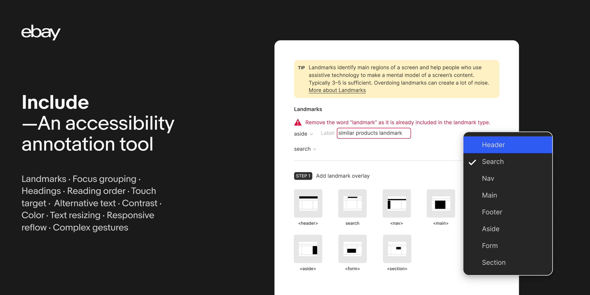
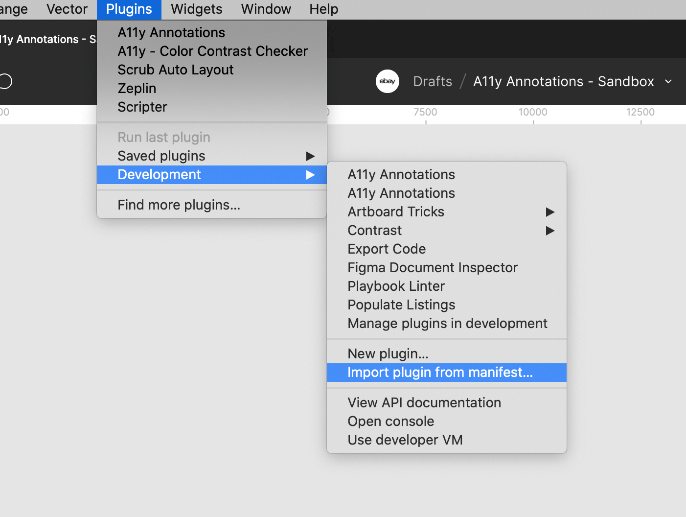

<div align="center">


# Include

an accessibility annotation Figma plugin

[Docs](https://include.ebaydesign.tech) ∙ [Try in Figma](https://www.figma.com/community/plugin/1208180794570801545/Include%3A-an-accessibility-annotation-tool) ∙ [Roadmap](#roadmap) ∙ [Contribute](#contributing)

</div>

## Intro



The eBay Include accessibility annotation Figma plugin is a tool to make annotating for accessibility (a11y) easier — easier for designers to spec and easier for developers to understand what is required.

The plugin was developed by members of the accessibility and design teams at eBay and is released for public use on Figma. You can view and install the latest version of the plugin [here](https://www.figma.com/community/plugin/1208180794570801545/Include%3A-an-accessibility-annotation-tool).

## Roadmap

**Near term bug fixes & improvements**

- [ ] Scan for svg (alternative text)
- [ ] Add images manually (alternative text)
- [ ] Synchronize copy/paste, undo/redo between the plugin and Figma layers
- [ ] Allow designer to annotate a section of a design
- [ ] Add delete in multiple steps
- [X] Add ability to edit landmarks (v12)
- [X] Placing new arrow annotation below at end of previously placed arrow (v11)
- [X] Touch target (v11)
- [X] Updates for keyboard navigation (v10)
- [X] Generate Responsive Designs from a single design (v10)
- [X] Rename landmarks to use the HTML names (e.g. footer) and not aria roles (e.g. contentinfo).

**Future explorations**

- [X] Touch target revision 
- [ ] Pointer gestures
- [ ] Split between focus & reading order
- [ ] Interactive elements step
- [ ] Use of AI to generate labels
- [ ] Cognitive step
- [ ] Hearing step

## Installation

```
npm i
```

## Development

```
npm run dev
```

To open **Inspect mode**

<kbd>⌘ Command</kbd> + <kbd>⌥ Option</kbd> + <kbd>I</kbd>

With the iframe of web app in a Figma plugin, hot-reloading doesn't really work, so to re-start the plugin quickly:

<kbd>⌘ Command</kbd> + <kbd>⌥ Option</kbd> + <kbd>P</kbd>

To open the plugin in development mode on Figma, map the manifest file at the root of this project.



See [docs](https://include.ebaydesign.tech) for more details on the project file structure and Figma layer methods used in this project.

## Contributing

The main purpose of this repository is to provide a jumping-off point for developers and designers who want to expand upon or customize the plugin's accessibility annotation functionality. We welcome pull requests, feature ideas, and bug reports.

- Pull requests are always welcome
- Submit GitHub issues for any feature enhancements, bugs, or documentation problems
- Read the [Contribution Tips and Guidelines](/contributing.md)
- Participants in this project agree to abide by its [Code of Conduct](https://github.com/eBay/.github/blob/main/CODE_OF_CONDUCT.md)

## License

Apache 2.0 - See [LICENSE](/LICENSE) for more information.
