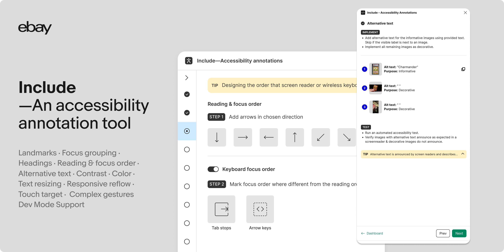
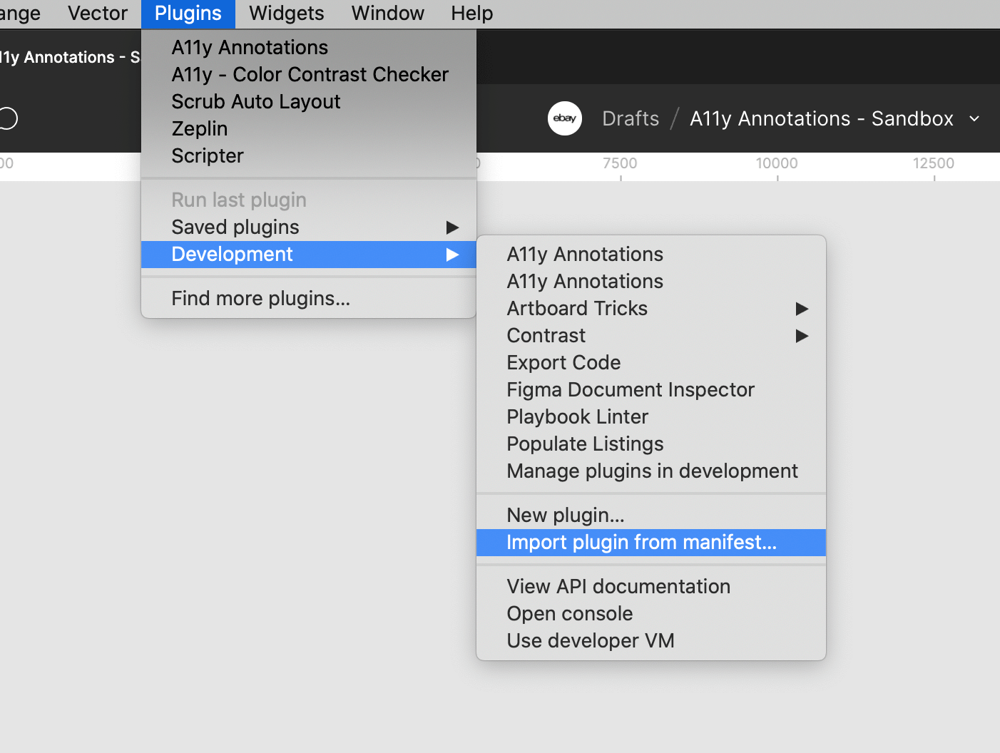

<div align="center">


# Include

an accessibility annotation Figma plugin

[Docs](https://include.ebaydesign.tech) ∙ [Try in Figma](https://www.figma.com/community/plugin/1208180794570801545/Include%3A-an-accessibility-annotation-tool) ∙ [Roadmap](#roadmap) ∙ [Contribute](#contributing)

</div>

## Intro



The eBay Include accessibility annotation Figma plugin is a tool to make annotating for accessibility (a11y) easier — easier for designers to spec and easier for developers to understand what is required.

The plugin was developed by members of the accessibility and design teams at eBay and is released for public use on Figma. You can view and install the latest version of the plugin [here](https://www.figma.com/community/plugin/1208180794570801545/Include%3A-an-accessibility-annotation-tool).

## What's new in v17

Version 17 adds a read-only inspect experience in Figma Dev Mode so developers can review existing annotations without changing the design file.

Features:

- added a read-only Dev Mode inspect experience, with a dashboard of annotated pages and previous/next step navigation
- added implement and test guidance from existing annotations (web and native); Color blindness is skipped in inspect
- added developer-focused step tips while keeping Design Mode playbook links
- scans other Figma pages in Dev Mode so annotations are not limited to the current page
- dashboard grid reflows as the Dev Mode panel is resized

Bug fixes:

- guard document writes in read-only Dev Mode (annotation key migration, designer checks, layer visibility) so opening inspect no longer throws
- fix contrast sampling using the wrong corner of a text node
- check native touch targets against the native minimum size
- fix collapsed step tip layout
- fix Dev Mode step footer scrolling out of view
- clicking a focus group in Dev Mode now zooms to and selects the Group Area layer
- tightened inspect copy across annotation steps

Open source code:

- updated manifest to use `editorType: ["figma", "dev"]` with `capabilities: ["inspect"]`
- centralized plugin constants (sizes, WCAG values, loading timeouts)
- added an ErrorBoundary fallback
- ignore non-plugin iframe window messages so listeners do not crash
- added prettier format scripts and a combined `lint:all` command

## Roadmap

**Near term bug fixes & improvements**

- [ ] Scan for svg (alternative text)
- [X] Add delete in multiple steps (v14)
- [X] Add images manually in Alternative text step (v14)
- [X] Add ability to edit landmarks (v12)
- [X] Placing new arrow annotation below at end of previously placed arrow (v11)
- [X] Touch target (v11)
- [X] Updates for keyboard navigation (v10)
- [X] Generate Responsive Designs from a single design (v10)
- [X] Rename landmarks to use the HTML names (e.g. footer) and not aria roles (e.g. contentinfo).

**Future explorations**

- [X] Touch target revision (v15)
- [X] Split between focus & reading order (v16)
- [X] Dev Mode inspect experience for developers (v17)
- [ ] Pointer gestures
- [ ] Interactive elements step
- [ ] Use of AI to generate labels
- [ ] Cognitive step
- [ ] Hearing step

## Installation

```
npm i
```

## Development

```
npm run dev
```

To open **Inspect mode**

<kbd>⌘ Command</kbd> + <kbd>⌥ Option</kbd> + <kbd>I</kbd>

With the iframe of web app in a Figma plugin, hot-reloading doesn't really work, so to re-start the plugin quickly:

<kbd>⌘ Command</kbd> + <kbd>⌥ Option</kbd> + <kbd>P</kbd>

To open the plugin in development mode on Figma, map the manifest file at the root of this project.



See [docs](https://include.ebaydesign.tech) for more details on the project file structure and Figma layer methods used in this project.

## Contributing

The main purpose of this repository is to provide a jumping-off point for developers and designers who want to expand upon or customize the plugin's accessibility annotation functionality. We welcome pull requests, feature ideas, and bug reports.

- Pull requests are always welcome
- Submit GitHub issues for any feature enhancements, bugs, or documentation problems
- Read the [Contribution Tips and Guidelines](/contributing.md)
- Participants in this project agree to abide by its [Code of Conduct](https://github.com/eBay/.github/blob/main/CODE_OF_CONDUCT.md)

## License

Apache 2.0 - See [LICENSE](/LICENSE) for more information.
